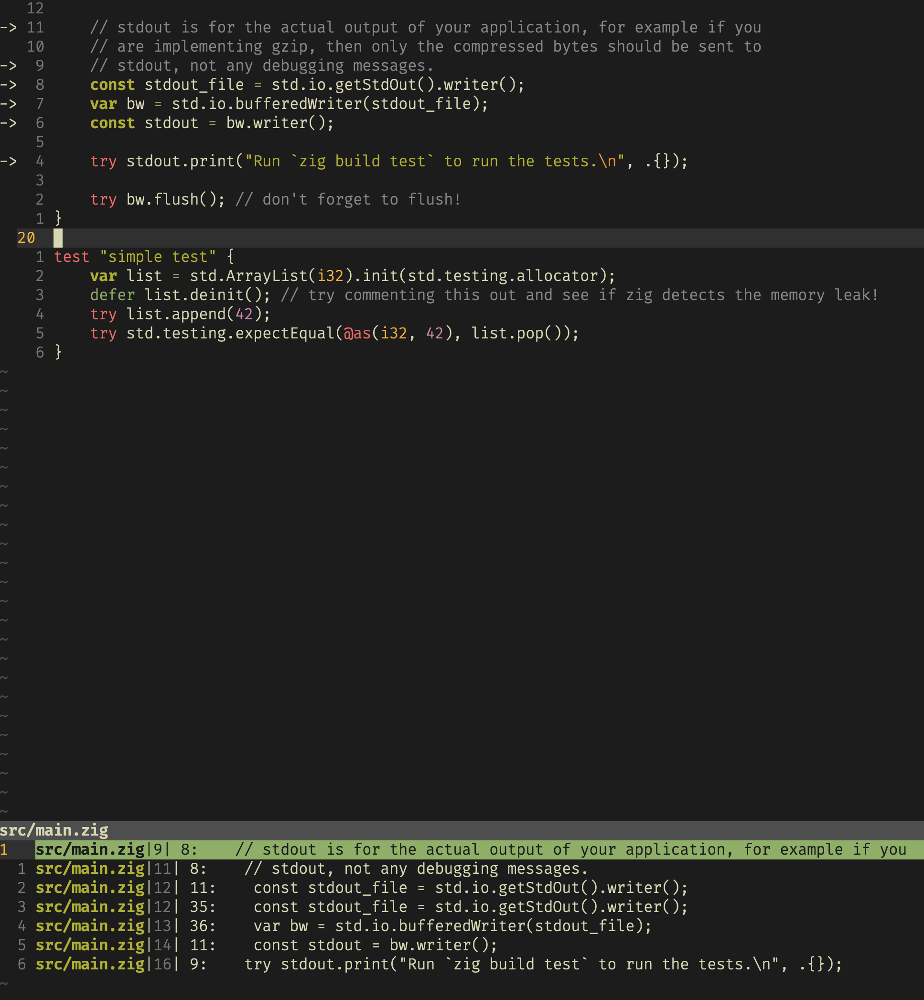

# vim-qf-arrows

### The minimalist way to utilise your signcolumn!

Ever thought: "How come I need to use a plugin with a whole bunch of features, just in order to be able to use my signcolumn? I wish there were an easy way to use it without a bunch of fancy features!"

Well, here you go! I present to you, the magnificent vim-qf-arrows plugin!

Once the plugin is installed, simply call the command `SetSigncolumnFromQf`, and you're good to go. It will place an arrow at all lines in the code where the quickfix-list has a corresponding entry. (Tip: you can write something á la `autocmd QuickfixCmdPost * SetSigncolumnFromQf` to auto-update your signs when doing a command that affects the quickfix list.) Once you're done, you can call `ClearSigncolumn` to clear all signs from the signcolumn.

### What does it look like?

Below: the result of running `grep stdout` and then `SetSigncolumnFromQf` on a newly initialized Zig project.



### How do I install it?

E.g. using Plug:

```
call plug#begin()
Plug 'joohing/vim-qf-arrows'
call plug#end()
```
